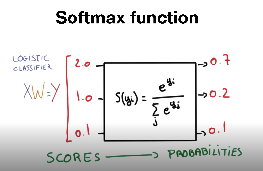

## Softmax Regression



```python
import tensorflow as tf
import numpy as np

x_data = [[1, 2, 1, 1],
          [2, 1, 3, 2],
          [3, 1, 3, 4],
          [4, 1, 5, 5],
          [1, 7, 5, 5],
          [1, 2, 5, 6],
          [1, 6, 6, 6],
          [1, 7, 7, 7]]
y_data = [[0, 0, 1],
          [0, 0, 1],
          [0, 0, 1],
          [0, 1, 0],
          [0, 1, 0],
          [0, 1, 0],
          [1, 0, 0],
          [1, 0, 0]]

#convert into numpy and float format
x_data = np.asarray(x_data, dtype=np.float32)
y_data = np.asarray(y_data, dtype=np.float32)

nb_classes = 3	# num classes (A, B, C - ONE-HOT-ENCODING)
```

```python
#Weight and bias setting
W = tf.Variable(tf.random.normal([4, nb_classes]), name='weight')
b = tf.Variable(tf.random.normal([nb_classes]), name='bias')
variables = [W, b]

print(W,b)
'''
<tf.Variable 'weight:0' shape=(4, 3) dtype=float32, numpy=
array([[-0.6701146 , -1.5312574 ,  0.73224336],
       [-0.37725016, -0.62765795, -2.5822446 ],
       [-0.67284334,  0.25653654, -0.3872052 ],
       [-0.040566  , -1.2135769 , -0.74410707]], dtype=float32)> <tf.Variable 'bias:0' shape=(3,) dtype=float32, numpy=array([ 0.83098805,  1.1333642 , -2.021677  ], dtype=float32)>
'''

# tf.nn.softmax computes softmax activations
# softmax = exp(logits) / reduce_sum(exp(logits), dim)
def hypothesis(X):
    return tf.nn.softmax(tf.matmul(X, W) + b)

print(hypothesis(x_data))
'''
tf.Tensor(
[[7.8521639e-01 2.1330991e-01 1.4736763e-03]
 [7.3885781e-01 2.1635184e-01 4.4790406e-02]
 [9.3267387e-01 1.1052889e-02 5.6273289e-02]
 [8.1645322e-01 8.1190309e-03 1.7542771e-01]
 [9.7152317e-01 2.8476795e-02 5.5822547e-09]
 [9.6908945e-01 3.0741360e-02 1.6914570e-04]
 [9.7133505e-01 2.8664880e-02 3.3331048e-08]
 [9.8231226e-01 1.7687758e-02 2.4469222e-09]], shape=(8, 3), dtype=float32)
'''
```

```python
# Softmax onehot test
sample_db = [[8,2,1,4]]
sample_db = np.asarray(sample_db, dtype=np.float32)

print(hypothesis(sample_db))
# tf.Tensor([[1.9345909e-01 3.7530765e-06 8.0653715e-01]], shape=(1, 3), dtype=float32)
```

```python
def cost_fn(X, Y):
    logits = hypothesis(X)
    cost = -tf.reduce_sum(Y * tf.math.log(logits), axis=1)
    cost_mean = tf.reduce_mean(cost)
    
    return cost_mean

print(cost_fn(x_data, y_data))
# tf.Tensor(3.0505724, shape=(), dtype=float32)
```

```python
def grad_fn(X, Y):
    with tf.GradientTape() as tape:
        cost = cost_fn(X, Y)
        grads = tape.gradient(cost, variables)
        return grads
    
print(grad_fn(x_data, y_data))
'''
[<tf.Tensor: shape=(4, 3), dtype=float32, numpy=
array([[ 1.2776283 , -0.6478476 , -0.6297807 ],
       [ 1.5626819 , -1.097654  , -0.46502787],
       [ 2.4111671 , -1.6839983 , -0.72716886],
       [ 2.5565305 , -1.8308179 , -0.7257124 ]], dtype=float32)>, <tf.Tensor: shape=(3,), dtype=float32, numpy=array([ 0.6459326 , -0.30569944, -0.34023324], dtype=float32)>]
'''
```

```python
def fit(X, Y, epochs=2000, verbose=100):
    optimizer = tf.optimizers.SGD(learning_rate=0.1, name='SGD')
    for i in range(epochs):
        grads = grad_fn(X, Y)
        optimizer.apply_gradients(zip(grads, variables))
        if (i==0) | ((i+1)%verbose==0):
            print('Loss at epoch %d: %f' %(i+1, cost_fn(X, Y).numpy()))
            
fit(x_data, y_data)
'''
Loss at epoch 1: 2.366735
Loss at epoch 100: 0.828323
Loss at epoch 200: 0.713423
Loss at epoch 300: 0.645316
Loss at epoch 400: 0.590446
Loss at epoch 500: 0.540575
Loss at epoch 600: 0.493011
Loss at epoch 700: 0.446594
Loss at epoch 800: 0.400709
Loss at epoch 900: 0.355054
Loss at epoch 1000: 0.309804
Loss at epoch 1100: 0.267477
Loss at epoch 1200: 0.242524
Loss at epoch 1300: 0.230401
Loss at epoch 1400: 0.219474
Loss at epoch 1500: 0.209489
Loss at epoch 1600: 0.200331
Loss at epoch 1700: 0.191903
Loss at epoch 1800: 0.184123
Loss at epoch 1900: 0.176922
Loss at epoch 2000: 0.170238
'''
```

```python
# prediction
a = hypothesis(x_data)
print(a)
print(tf.argmax(a, 1))
print(tf.argmax(y_data, 1)) # matches with y_data
'''
tf.Tensor(
[[2.5506436e-06 8.7754463e-04 9.9911994e-01]
 [1.0952300e-03 9.1185570e-02 9.0771919e-01]
 [1.1513348e-07 1.7789358e-01 8.2210630e-01]
 [1.5890674e-06 8.3665663e-01 1.6334181e-01]
 [2.7380353e-01 7.1308005e-01 1.3116424e-02]
 [1.4408457e-01 8.5591483e-01 5.6868009e-07]
 [7.3764908e-01 2.6234201e-01 8.8387587e-06]
 [9.1215891e-01 8.7841049e-02 1.2655407e-07]], shape=(8, 3), dtype=float32)
tf.Tensor([2 2 2 1 1 1 0 0], shape=(8,), dtype=int64)
tf.Tensor([2 2 2 1 1 1 0 0], shape=(8,), dtype=int64)
'''
```

